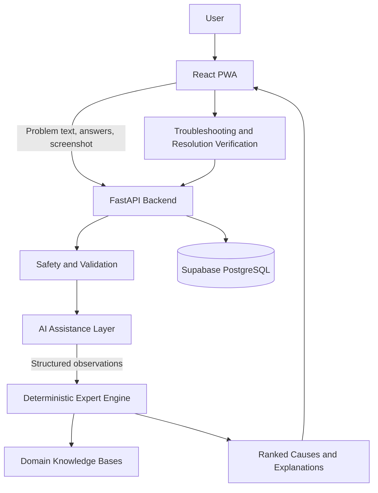

# FixIT Saarthi

A hybrid expert system for structured Windows computer troubleshooting.

## Overview

FixIT Saarthi guides users through common computer problems using natural-language input, targeted questions, deterministic diagnostic rules, safe troubleshooting steps, and explicit resolution verification.

The system uses AI for natural-language understanding and supported screenshot interpretation. Final diagnosis and cause ranking are controlled by domain-specific expert rules rather than generated directly by the AI model.

## Core Features

- Four troubleshooting domains
- Natural-language problem description
- Deterministic expert diagnosis with ranked causes and explanations
- Targeted diagnostic questions with Yes, No, and Skip handling
- Optional Task Manager screenshot analysis for performance problems
- Domain-intent detection with user-controlled domain switching
- Safety-labelled troubleshooting steps: Safe, Caution, Advanced
- Explicit user confirmation before a session is marked resolved
- Supabase-based session persistence
- Resolved diagnosis report with Print / Save PDF support
- AI provider failover and output validation
- Progressive Web App support

## Supported Domains

1. Performance and Freezing
2. Boot Failures and Startup
3. Network and Connectivity
4. Driver and Peripheral Problems

## System Architecture



## Diagnostic Flow

```text
Problem description
        |
        v
Domain intent detection
        |
        v
AI or heuristic symptom parsing
        |
        v
Safety validation
        |
        v
Targeted questions
        |
        v
Structured observations
        |
        v
Domain-specific expert evaluation
        |
        v
Ranked causes and explanations
        |
        v
Safety-labelled troubleshooting
        |
        v
User verification
        |
        v
Resolved session and report
```

## Technology Stack

| Layer | Technology |
|---|---|
| Frontend | React, TypeScript, Vite, Tailwind CSS |
| App model | Progressive Web App |
| Backend | Python, FastAPI |
| Expert engine | Python rule-based evaluation and ranking |
| AI | Google Gemini with Groq fallback |
| Database | Supabase PostgreSQL |
| Validation | Pydantic, frontend TypeScript types |
| Testing | Pytest, Vitest |

## Project Structure

```text
backend/
├── app/
│   ├── api/             # FastAPI routes
│   ├── db/              # Supabase session persistence
│   ├── expert_engine/   # Rule evaluation, ranking, explanations
│   ├── gemini/          # AI providers, parsing and safety validation
│   ├── knowledge_base/  # Domain-specific symptoms, rules and fixes
│   ├── schemas/         # Backend request and response models
│   └── main.py          # FastAPI application entry point
├── tests/               # Backend test suite
├── frontend/
│   ├── src/
│   │   ├── components/  # Workflow and UI components
│   │   ├── api/         # Backend API client
│   │   ├── types/       # Shared frontend types
│   │   └── utils/       # Domain intent and UI utilities
│   └── ...
├── requirements.txt
└── .env.example
```

## Local Setup

### Prerequisites

- Python 3.11+
- Node.js 18+
- npm
- Supabase project
- Gemini API key
- Groq API key for provider fallback

### Backend

From the repository root:

```powershell
python -m venv .venv
.\.venv\Scripts\Activate.ps1
pip install -r requirements.txt
uvicorn app.main:app --reload
```

### Frontend

From `backend/frontend`:

**Planned for Future Releases**:
- 🔄 **Boot Failure / Slow Startup** domain
- 🌐 **Network / Connectivity** domain
- 🗄️ **Supabase PostgreSQL** session persistence & diagnostic history
- 📱 **QR Code Cross-Device Session Sync**

---

## 🔄 Continuous Integration (CI)

FixIT Saarthi uses **GitHub Actions** for continuous integration (`.github/workflows/ci.yml`). Every push or pull request targeting the `main` branch automatically triggers:

- **Backend Tests**: Executes the complete Pytest suite (`python -m pytest tests -v`) on Python 3.11.
- **Frontend Tests**: Executes the Vitest suite (`npx vitest run`) on Node.js 20.
- **Frontend Production Build**: Validates TypeScript compilation and Vite PWA production bundle creation (`npm run build`).
- **Docker Validation**: Builds and validates Docker images for both `backend` and `frontend` services using BuildKit without pushing to a registry.

