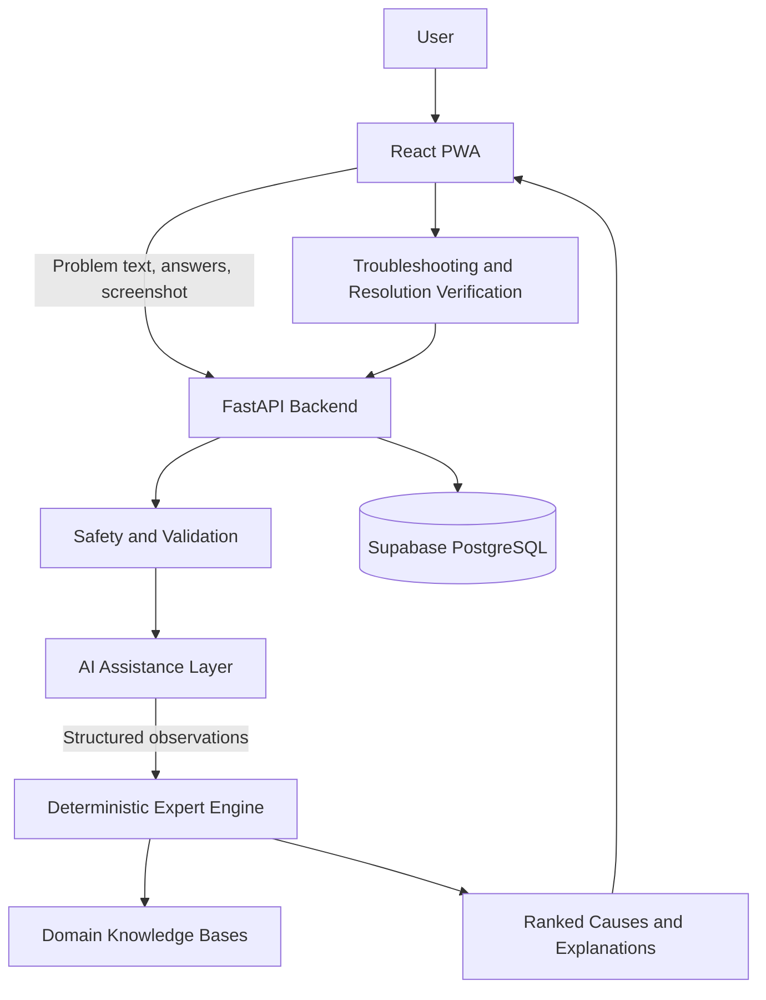

# FixIT Saarthi

A hybrid expert system for structured Windows computer troubleshooting.

## Overview

FixIT Saarthi guides users through common computer problems using natural-language input, targeted questions, deterministic diagnostic rules, safe troubleshooting steps, and explicit resolution verification.

The system uses AI for natural-language understanding and supported screenshot interpretation. Final diagnosis and cause ranking are controlled by domain-specific expert rules rather than generated directly by the AI model.

## Core Features

- Four troubleshooting domains
- Natural-language problem description
- Deterministic expert diagnosis with ranked causes and explanations
- Targeted diagnostic questions with Yes, No, and Skip handling
- Optional Task Manager screenshot analysis for performance problems
- Domain-intent detection with user-controlled domain switching
- Safety-labelled troubleshooting steps: Safe, Caution, Advanced
- Explicit user confirmation before a session is marked resolved
- Supabase-based session persistence
- Resolved diagnosis report with Print / Save PDF support
- AI provider failover and output validation
- Progressive Web App support

## Supported Domains

1. Performance and Freezing
2. Boot Failures and Startup
3. Network and Connectivity
4. Driver and Peripheral Problems

## System Architecture



## Diagnostic Flow

```text
Problem description
        |
        v
Domain intent detection
        |
        v
AI or heuristic symptom parsing
        |
        v
Safety validation
        |
        v
Targeted questions
        |
        v
Structured observations
        |
        v
Domain-specific expert evaluation
        |
        v
Ranked causes and explanations
        |
        v
Safety-labelled troubleshooting
        |
        v
User verification
        |
        v
Resolved session and report
```

## Technology Stack

| Layer | Technology |
|---|---|
| Frontend | React, TypeScript, Vite, Tailwind CSS |
| App model | Progressive Web App |
| Backend | Python, FastAPI |
| Expert engine | Python rule-based evaluation and ranking |
| AI | Google Gemini with Groq fallback |
| Database | Supabase PostgreSQL |
| Validation | Pydantic, frontend TypeScript types |
| Testing | Pytest, Vitest |

## Project Structure

```text
backend/
├── app/
│   ├── api/             # FastAPI routes
│   ├── db/              # Supabase session persistence
│   ├── expert_engine/   # Rule evaluation, ranking, explanations
│   ├── gemini/          # AI providers, parsing and safety validation
│   ├── knowledge_base/  # Domain-specific symptoms, rules and fixes
│   ├── schemas/         # Backend request and response models
│   └── main.py          # FastAPI application entry point
├── tests/               # Backend test suite
├── frontend/
│   ├── src/
│   │   ├── components/  # Workflow and UI components
│   │   ├── api/         # Backend API client
│   │   ├── types/       # Shared frontend types
│   │   └── utils/       # Domain intent and UI utilities
│   └── ...
├── requirements.txt
└── .env.example
```

## Local Setup

### Prerequisites

- Python 3.11+
- Node.js 18+
- npm
- Supabase project
- Gemini API key
- Groq API key for provider fallback

### Backend

From the repository root:

```powershell
python -m venv .venv
.\.venv\Scripts\Activate.ps1
pip install -r requirements.txt
uvicorn app.main:app --reload
```

### Frontend

From `backend/frontend`:

```powershell
npm install
npm run dev
```

The frontend normally runs on `http://localhost:5173` during local development.

## Environment Variables

Create a backend `.env` file from `.env.example` and provide the required service credentials.

Typical configuration includes:

```text
SUPABASE_URL=...
SUPABASE_SECRET_KEY=...
GEMINI_API_KEY=...
GROQ_API_KEY=...
```

Keep `.env` out of version control. Never expose service-role or provider credentials to the frontend.

## Testing

Run the backend tests from the repository root:

```powershell
python -m pytest backend/tests -v
```

Run frontend unit tests from `backend/frontend`:

```powershell
npx vitest run
```

Build the production frontend from `backend/frontend`:

```powershell
npm run build
```

Current validated state:

- Backend tests: 87 passed
- Frontend unit tests: 13 passed
- Production build: passed

## Safety and Design Principles

- AI assists with interpretation. It does not directly control final diagnosis ranking.
- AI output is constrained to supported symptom keys and checked by the safety layer.
- Each troubleshooting domain uses its own knowledge base and evaluator configuration.
- Skipped questions are treated as unavailable evidence rather than guessed answers.
- The system does not claim access to privileged operating-system data that browser APIs cannot provide.
- Sessions are marked resolved only after explicit user confirmation.
- Screenshots are processed as diagnostic input and are not stored as session image data.

## Current Scope

FixIT Saarthi is focused on common Windows troubleshooting scenarios across the four supported domains. It is designed as a guided diagnostic assistant, not as a replacement for professional hardware repair or unrestricted operating-system administration.

Public hosting, containerization, CI/CD, and other deployment work are planned as subsequent project stages.
